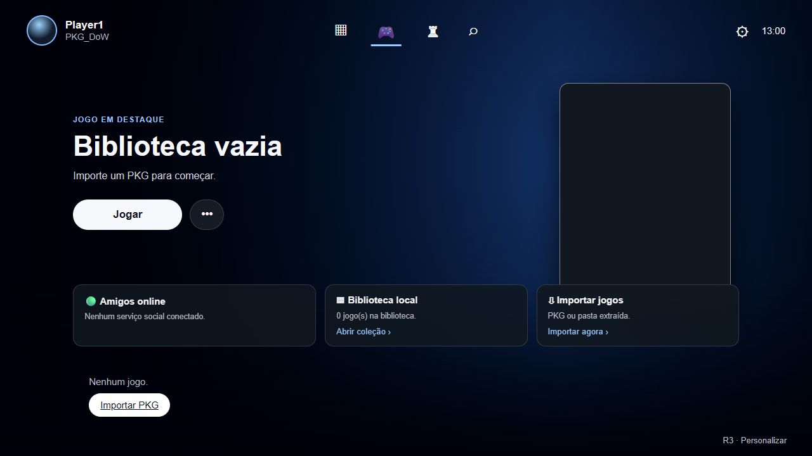
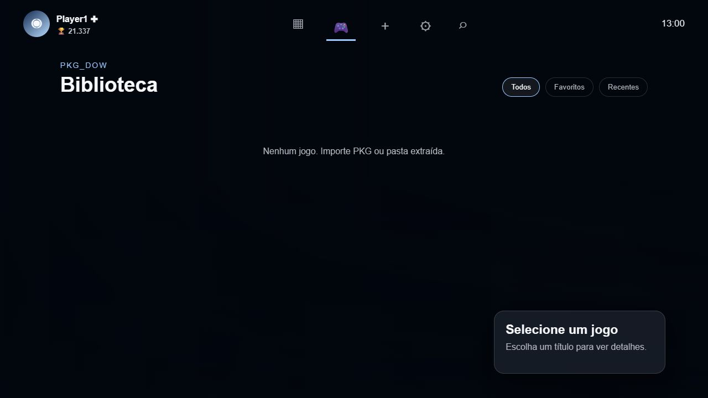
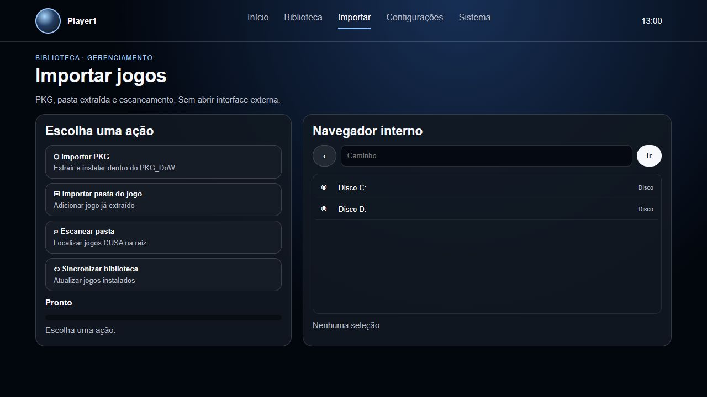
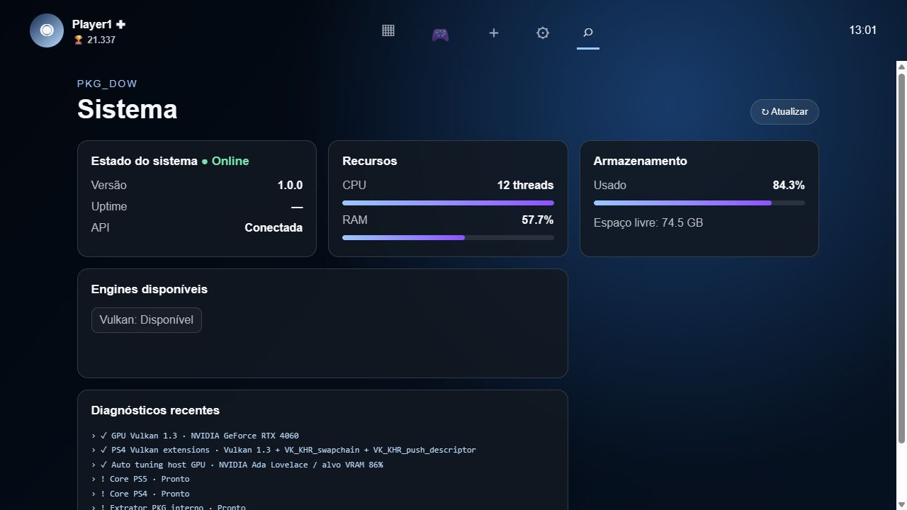

<div align="center">


### Lightweight by default. Modular by design. Built to download only what you need.


<br><br>

**Library · PKG Import · Hardware Diagnostics · Modular Engines · AutoBoost**

</div>

---

## ⚡ Um launcher. Múltiplos cores. Zero peso inútil.

PKG_DoW reúne biblioteca, importação de conteúdo, diagnóstico de hardware e execução de cores em uma interface desktop. Projeto não carrega runtimes gigantes, builds, jogos ou emuladores pré-instalados: instalador busca cada módulo sob demanda.

```text
Clone pequeno → Setup.cmd → Runtime isolado → Core escolhido → PKG_DoW UI
```

> [!IMPORTANT]
> Projeto não inclui jogos, firmware, chaves, BIOS nem conteúdo protegido. Use somente backups obtidos legalmente. PKG_DoW não possui vínculo com Sony Interactive Entertainment, PlayStation, Kyty ou shadPS4.

## 🖥️ UX real

Capturas feitas diretamente da interface local. Sem mockup.

<table>
  <tr>
    <td width="50%"><br><b>Início</b></td>
    <td width="50%"><br><b>Biblioteca</b></td>
  </tr>
  <tr>
    <td width="50%"><br><b>Importação</b></td>
    <td width="50%"><br><b>Sistema e diagnóstico</b></td>
  </tr>
</table>

## 🔥 AutoBoost: Vulkan e frame time

Fork não troca só skin. Caminho gráfico recebeu mudanças voltadas a reduzir espera de CPU/GPU, recompilação repetida, pressão de VRAM e travadas durante jogo.

| Modificação | Como funciona | Impacto esperado |
| :-- | :-- | :-- |
| **Async compute multi-queue** | Filas compute possuem scheduler dedicado e timeline mestre compartilhada com fila gráfica | Melhor sobreposição entre trabalho gráfico e compute quando título permite |
| **Pipeline compiler paralelo** | Compilação em background usa múltiplos workers, ajustáveis por `KYTY_PIPELINE_WORKERS` | Menos stutter causado por pipelines novos |
| **Descriptor-set cache** | Reutiliza descriptors dentro da submissão em vez de recriar estado idêntico | Menos alocação e menos overhead de CPU/driver |
| **Upload ring sem bloqueio** | Ring buffer usa spill buffers quando região principal está ocupada | Evita espera forçada em uploads transitórios |
| **Synchronization2 estreita** | Barriers usam estágios e acessos mais específicos; leitura→leitura redundante pode ser eliminada | Menos serialização desnecessária da GPU |
| **VRAM adaptativa** | `VK_EXT_memory_budget` alimenta limites de pressão, reserva e residência por GPU | Menos thrashing, eviction e estouro de VRAM |
| **Cache persistente** | Pipelines reaproveitados entre execuções quando driver e dispositivo continuam compatíveis | Segundo boot tende a compilar menos trabalho |
| **Wait registry cross-queue** | Coordena labels entre filas e possui proteção contra deadlock | Mais estabilidade sem transformar espera em busy-loop |
| **Perfis por arquitetura** | Ampere, Ada e Blackwell recebem políticas automáticas de memória/cache | Configuração inicial mais adequada ao hardware real |

Pipeline mantido corretamente:

```text
Prospero / RDNA2 → decoder → IR → otimizações → SPIR-V → Vulkan → driver da GPU
```

Não existe conversão falsa para “código NVIDIA”. Vulkan e driver continuam responsáveis pela compilação final para hardware instalado.

### Por que difere de build padrão

- Launcher detecta hardware e escolhe política; build padrão costuma deixar ajuste manual.
- Cores e runtimes são módulos; atualização não exige baixar repositório gigante.
- Trabalho compute pode avançar em fila própria, em vez de disputar sempre fila gráfica.
- Cache, upload e descriptors atacam fontes comuns de stutter, não somente média de FPS.
- Diagnóstico mostra Vulkan, arquitetura, VRAM, cache e prontidão antes do boot.
- Correção sRGB estreita preserva fidelidade em formatos `R8/R8G8` com fallback UNORM.

> [!NOTE]
> Arquitetura possui potencial real para frame time mais estável e FPS maior em cargas limitadas por pipeline, sincronização ou driver. Ganho varia por jogo, GPU e driver. Ainda não existe suíte pública A/B suficiente para afirmar porcentagem universal ou vitória sobre todo emulador atual. Correção sRGB melhora imagem, não FPS.

### Benchmark sério

Comparação válida precisa usar mesmo jogo legal, save, cena, resolução, driver, shader cache e duração. Publique média, 1% low, 0,1% low e gráfico de frame time. Até existir esse resultado, projeto vende engenharia verificável — não número inventado.

## Instalação

Requisitos: Windows 10/11 x64, conexão com internet e GPU com Vulkan atual.

```text
1. Baixe código pelo botão Code > Download ZIP
2. Extraia pasta
3. Execute Setup.cmd
4. Escolha cores desejados
5. Abra 1.bat
```

Instalador:

- encontra ou instala Python 3.10+;
- cria ambiente isolado em `.runtime/`;
- baixa PyQt6 e WebEngine;
- oferece core PS4 e PS5 separadamente;
- valida SHA-256 dos pacotes PS4;
- mantém downloads, engines e jogos fora do Git.

Instalação automatizada:

```powershell
powershell -ExecutionPolicy Bypass -File tools/install.ps1 -WithPS4 -Launch
```

Opções disponíveis: `-WithPS4`, `-WithPS5`, `-Launch` e `-Force`.

## O que fica no repositório

```text
PKG_DoW/
├── Setup.cmd                 # instalador principal
├── 1.bat                     # launcher
├── webui/                    # interface
├── tools/                    # backend, instalação e diagnóstico
├── src/                      # fonte do core KytyPS5
├── tests/                    # regressões
├── 3rdparty/                 # referências para submódulos Git
└── .github/                  # CI e templates
```

Gerado apenas na máquina do usuário:

```text
.runtime/     Python e bibliotecas
engines/      cores PS4/PS5
userdata/     biblioteca e jogos importados
logs/         diagnóstico
_Build/       compilação local
```

## Recursos

- Interface desktop moderna baseada em WebEngine
- Biblioteca local com capas, serial, região e versão
- Importação e instalação de PKG compatível com core configurado
- Seleção automática PS4/PS5 por metadados
- Diagnóstico de Vulkan, GPU, RAM, disco e runtimes do Windows
- Perfis de GPU e cache de pipelines
- Cores independentes, substituíveis e atualizáveis
- Servidor local restrito a `127.0.0.1`

## Atualização e remoção

Execute `Setup.cmd` novamente para reparar dependências. Use `-Force` para recriar ambiente.

Para remover componentes baixados, apague `.runtime/` e `engines/`. Biblioteca do usuário fica em `userdata/`; faça backup antes de removê-la.

## Desenvolvimento

Clone com dependências C++:

```powershell
git clone --recurse-submodules URL_DO_REPOSITORIO
cd emulador
```

Teste camada Python sem instalar interface:

```powershell
python tools/test_pkg_dow_server.py
python tools/test_engine_doctor.py
```

Build Windows requer CMake, Ninja, Visual Studio Build Tools 2022 com `clang-cl`, Qt 6 e Vulkan SDK:

```powershell
cmake -S . -B _Build/windows -G Ninja `
  -DCMAKE_BUILD_TYPE=Release `
  -DCMAKE_C_COMPILER=clang-cl `
  -DCMAKE_CXX_COMPILER=clang-cl `
  -DCMAKE_PREFIX_PATH="C:/Qt/6.x.x/msvc2022_64"

cmake --build _Build/windows --target launcher --parallel
cmake --install _Build/windows --prefix _Build/windows/install
```

CI compila Windows, Linux e macOS e publica artefatos somente em releases. Binários gerados nunca devem entrar no histórico Git.

## Segurança

- Downloads PS4 usam URLs oficiais e hashes fixos.
- Interface não expõe servidor para rede externa por padrão.
- Nenhum dado de conta é solicitado.
- Nenhuma telemetria é enviada pelo launcher.

Falha encontrada? Abra issue com sistema, GPU, versão do driver, core usado e log completo — nunca envie jogos, chaves ou firmware.

## Licença

Código distribuído sob [GPL-2.0](LICENSE). Dependências mantêm licenças próprias em `LICENSES/` e respectivos repositórios.

---

<div align="center">

## Built to stay lean.

### Instale launcher. Escolha core. Controle ambiente.


<br><br>

**Windows · PS4 · PS5 · Vulkan · Python · Qt**


</div>
